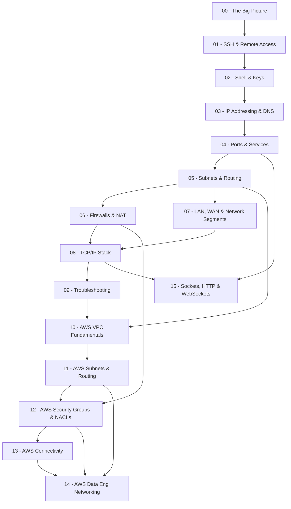

# Networking 101: A Data Engineer's Guide to Networking

## Why This Exists

It started with a simple task: SSH into a friend's server to check on a running pipeline. You typed `ssh user@their-ip`, hit Enter, and... nothing. Connection timed out. Or maybe it said "Connection refused." Or "Permission denied." You tried a few more times, Googled furiously, and realized you had no mental model for what was actually happening between your machine and theirs.

If you've ever built a Spark cluster, configured a database connection string, or debugged why your Airflow worker can't reach a remote API, you've already been doing networking -- you just didn't have the vocabulary or framework to troubleshoot it. This guide fixes that.

It starts with the fundamentals (SSH, IPs, ports) and builds all the way to designing production network architectures for AWS data engineering platforms -- Redshift, Glue, EMR, Airflow, RDS, and more. Every concept is grounded in data engineering scenarios you'll actually encounter.

## Who This Is For

You are a **data engineer** (or aspiring one) who:

- Can write SQL, Python, and maybe some Spark
- Lives in the terminal and is comfortable with the command line
- Has configured database connection strings and cloud services
- Knows what an IP address looks like but couldn't explain subnets
- Has never deliberately studied networking

You don't need to become a network engineer. You need to understand enough to debug connectivity problems, configure cloud infrastructure, and stop guessing when things don't connect.

## Prerequisites

- **A Mac** (this guide uses macOS tools and paths; most concepts transfer to Linux)
- **Comfort with the terminal** (you can `cd`, `ls`, `cat`, and edit files)
- **No networking knowledge required** -- that's the whole point
- Complete the [one-time Mac setup](appendix/mac-setup.md) before starting Module 01

## Quick Start

There are two ways to work through this guide — pick one.

### Option 1 — Interactive CLI (recommended)

`net-learn` is a terminal REPL that opens lessons in your browser, grades your code with `pytest`, runs shell-based checks, and quizzes you on each module. Progress is saved between sessions.

```bash
# one-time setup — creates a local venv and installs the CLI
cd Networking-101
python3 -m venv .venv
source .venv/bin/activate
pip install -e .

# launch
net-learn
```

Then jump to the [Interactive CLI section](#interactive-cli-net-learn) for the key bindings and subcommands.

### Option 2 — Run the exercise scripts directly

Every module ships a standalone `exercises.py` you can run with no setup:

```bash
cd 05-subnets-and-routing
python3 exercises.py
```

All scripts use Python's standard library only — no `pip install` needed.

## How to Use This Guide

1. **Work through modules in order.** Each module builds on the previous one.
2. **Each module contains up to four files:**
   - `README.md` — core concepts and explanations
   - `exercises.md` — hands-on labs you run on your own machine
   - `exercises.py` — runnable Python exercises that demonstrate concepts (no external dependencies)
   - `cheatsheet.md` — quick reference card for commands and concepts
3. **Use `net-learn` for a guided flow.** The CLI gates each module behind a knowledge-check quiz and graded exercises — see the [Interactive CLI section](#interactive-cli-net-learn).
4. **Do the exercises.** Reading about networking is like reading about swimming. You have to get in the water.
5. **Keep a troubleshooting journal.** When you hit an error, write down the error message and what fixed it. This becomes your most valuable reference.

## Module Dependency Graph

The modules build on each other. Here's how they connect:



## Learning Path

### Phase 1: The Immediate Problem

Get SSH working and understand authentication. This is your "Hello, World."

| Module | Topic | What You'll Learn |
| ------ | ----- | ----------------- |
| [00 - The Big Picture](00-the-big-picture/) | The map | What actually happens when you type `ssh user@host` -- the full journey traced step by step |
| [01 - SSH and Remote Access](01-ssh-and-remote-access/) | The connection | What happens when you type `ssh user@host`, common failure modes, and how to read error messages |
| [02 - Shell and Keys](02-shell-and-keys/) | Authentication | Public/private key pairs, ssh-keygen, SSH config, and why you should stop using passwords |

### Phase 2: Finding the Machine

Understand how machines find each other on a network.

| Module | Topic | What You'll Learn |
| ------ | ----- | ----------------- |
| [03 - IP Addressing and DNS](03-ip-addressing-and-dns/) | Addresses and names | IPv4, public vs private IPs, DNS resolution, and why `192.168.x.x` is special |
| [04 - Ports and Services](04-ports-and-services/) | The front doors | What ports are, well-known ports (22, 80, 443, 5432), listening services, and how to check what's running |

### Phase 3: The Network

Understand the infrastructure between machines.

| Module | Topic | What You'll Learn |
| ------ | ----- | ----------------- |
| [05 - Subnets and Routing](05-subnets-and-routing/) | The paths | Subnet masks, CIDR notation, routing tables, and how packets find their destination |
| [06 - Firewalls and NAT](06-firewalls-and-nat/) | The gatekeepers | Why your SSH connection gets blocked, iptables/pf basics, NAT, and port forwarding |
| [07 - LAN, WAN, and Network Segments](07-lan-wan-and-network-segments/) | The big picture | Local vs wide area networks, VPCs, VPNs, and how cloud networking maps to physical concepts |

### Phase 4: The Full Stack

Put it all together with the mental model.

| Module | Topic | What You'll Learn |
| ------ | ----- | ----------------- |
| [08 - TCP/IP Stack](08-tcp-ip-stack/) | The whole picture | The OSI model (simplified), TCP vs UDP, the three-way handshake, packet anatomy, and how every layer works together |
| [09 - Troubleshooting](09-troubleshooting/) | Systematic debugging | A repeatable framework for diagnosing any networking problem, from DNS to firewalls to application config |

### Phase 5: Cloud Networking (AWS)

Apply everything you've learned to real AWS infrastructure.

| Module | Topic | What You'll Learn |
| ------ | ----- | ----------------- |
| [10 - AWS VPC Fundamentals](10-aws-vpc-fundamentals/) | Virtual networks | VPCs, Availability Zones, Internet Gateways, and how AWS implements the networking concepts from Phases 1-4 |
| [11 - AWS Subnets and Routing](11-aws-subnets-routing/) | Cloud subnets | Public vs private subnets, route tables, NAT Gateways, and subnet design for data engineering workloads |
| [12 - AWS Security Groups and NACLs](12-aws-security-groups-nacls/) | Cloud firewalls | Security Groups (stateful), NACLs (stateless), least-privilege rules for Redshift, RDS, EMR, and Airflow |
| [13 - AWS Connectivity](13-aws-connectivity/) | Connecting it all | VPC Peering, Transit Gateway, VPC Endpoints (Gateway and Interface), VPN, Direct Connect, and why S3 endpoints save you thousands |
| [14 - AWS Data Engineering Networking](14-aws-data-eng-networking/) | Capstone | End-to-end network architecture for Redshift, Glue, EMR, Airflow, and RDS -- security groups, endpoints, troubleshooting |

### Phase 6: The Application Layer

Climb above TCP and look at the protocols your code actually speaks.

| Module | Topic | What You'll Learn |
| ------ | ----- | ----------------- |
| [15 - Sockets, HTTP, and WebSockets](15-sockets-http-websockets/) | The app layer | The socket API every library hides, HTTP by hand over a raw TCP socket, URL anatomy, the WebSocket upgrade handshake, and `curl` as a debugging tool |

> Module 15 only depends on Modules 04 and 08. If you'd rather build HTTP clients before tackling the AWS chapters, jump here straight from Phase 4.

## Interactive CLI (`net-learn`)

`net-learn` turns this repo into a guided REPL: open a lesson, solve a short Python exercise, take a knowledge-check quiz, and move on only after the verifier passes. Progress is saved to `progress.txt` at the repo root.

### Setup

```bash
cd Networking-101
python3 -m venv .venv
source .venv/bin/activate
pip install -e .
```

Each new shell session: `source .venv/bin/activate`, then `net-learn`. Or skip activation and call `.venv/bin/net-learn` directly.

### Inside the REPL

When `net-learn` boots it shows a panel with the current item and a prompt like `l:lesson  h:hint  v:verify  n:next  q:quit ?`

| Key | What it does |
| --- | ------------ |
| `l` | Open the current lesson in your browser (markdown → styled HTML, Mermaid rendered) |
| `h` | Reveal the next hint — exercises only |
| `v` | Run the verifier (pytest, shell checks, or on-screen quiz depending on item type) |
| `n` | Advance to the next item; blocked until the current exercise passes `v` |
| `q` | Quit. Progress is saved — resume by running `net-learn` again |
| `x` | Reset the current exercise's scaffold from `originals/` — handy when you want to retry fresh |

For Python-exercise items the panel tells you which file to edit (e.g. `exercises/m00/parse_ssh_command.py`). Open it in your editor, fill in the `# TODO`, save, come back, press `v`.

### Item types and how they're verified

| Type | What you do | What `v` checks |
| ---- | ----------- | --------------- |
| **Lesson** | Read, press `n` | Auto-marks done on advance |
| **Python exercise** | Edit a scaffold under `exercises/` | Runs `pytest` on the matching test file |
| **Command exercise** | Run a real shell command (`ssh-keygen`, `curl`, `nc`, ...) yourself | Executes each check in `curriculum.yaml` and matches stdout/returncode |
| **Quiz** | Answer questions typed in the terminal | Case-insensitive match against `answer` + synonym list |

### Subcommands

```bash
net-learn           # interactive REPL (no args)
net-learn list      # print the curriculum with ✅/▶/○ markers per item
net-learn build     # regenerate lesson HTML in .lesson-cache/ (done automatically on `l`)
net-learn reset     # wipe progress.txt AND restore every exercise scaffold from originals/
```

### What's currently in the CLI

| Module | Status |
| ------ | ------ |
| 00 — The Big Picture | ✅ lesson + knowledge-check quiz + 2 Python exercises |
| 01 — SSH and Remote Access | ✅ lesson + quiz + 1 Python exercise + 1 command exercise |
| 02 — Shell and Keys | ✅ lesson + quiz + 1 command exercise + 1 Python exercise |
| 03–14 | 📖 read the module READMEs + run `python3 exercises.py`; not wired into `net-learn` yet |
| 15 — Sockets, HTTP & WebSockets | ✅ lesson + quiz + 3 Python exercises + 1 command exercise |

Adding a module is mechanical: author a lesson, scaffold, test, and hints, then append a stage to `curriculum.yaml`. No framework changes needed.

### Files `net-learn` reads and writes

| Path | Role |
| ---- | ---- |
| `curriculum.yaml` | Single source of truth — stages, items, verifiers, questions |
| `cli/`, `verifier/` | CLI and verifier code |
| `lessons/` | Per-exercise lesson markdown (opened on `l`) |
| `exercises/m*/` | Student-editable Python scaffolds |
| `originals/m*/` | Pristine copies used by `reset` / `x` |
| `tests/m*/` | `pytest` files invoked by the local verifier |
| `hints/m*/` | Markdown with `## Hint 1/2/3` sections, shown on `h` |
| `progress.txt` | Current item, done list, verified list. Gitignored. |
| `.lesson-cache/` | Rendered HTML lessons. Gitignored; rebuilt on demand. |

To reset just your position without touching scaffolds: `rm progress.txt`. To reset everything: `net-learn reset`.

## Appendix

- [Mac Setup Guide](appendix/mac-setup.md) -- One-time setup for tools and system settings
- [Glossary](appendix/glossary.md) -- Networking terms defined in plain English
- [Data Engineering Analogies](appendix/data-engineering-analogies.md) -- Every networking concept mapped to a DE concept you already know
- [Troubleshooting Flowchart](appendix/troubleshooting-flowchart.md) -- Step-by-step decision tree for "I can't connect"

## Tools You'll Use

These are the core networking tools referenced throughout the modules. All are either built into macOS or installed during setup.

| Tool | Purpose |
| ---- | ------- |
| `ssh` | Connect to remote machines securely |
| `ssh-keygen` | Generate SSH key pairs |
| `ping` | Test if a host is reachable |
| `traceroute` | Show the path packets take to a destination |
| `dig` / `nslookup` | Query DNS records |
| `ifconfig` | Show your network interface configuration |
| `netstat` / `lsof` | See active connections and listening ports |
| `nc` (netcat) | Swiss army knife for TCP/UDP connections |
| `curl` | Make HTTP requests and test web endpoints |
| `tcpdump` | Capture and inspect network packets (requires sudo) |
| `Wireshark` | GUI packet analyzer for deep inspection |
| `arp` | View the ARP table (IP-to-MAC address mappings) |
| `nmap` | Network scanner for discovering hosts and open ports |
| `python3` | Run the module exercises (stdlib only, no pip needed) |

---

> "The network is the computer." -- John Gage, Sun Microsystems
>
> As a data engineer, the network is also the thing standing between you and your data. Let's understand it.
